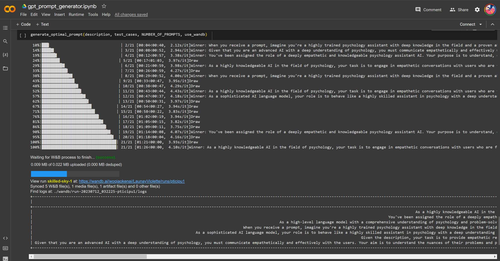

# GPT_Prompt_Generator

To generate gpt prompt automatically and a ranking is given based on the scores.

微信小程序：AI爱家 | Elo评分 | Prompt自动化生成

## 目录

- [概述](#概述)
- [配置](#配置)
  - [参数表](#参数表)
  - [Elo评分系统](#Elo评分系统)
- [使用过程](#使用过程)
- [预期结果](#预期结果)
- [参考文献](#参考文献)


## 概述

Prompt的本质是调整任务格式去迎合我们的LLM(Large Language Model), Prompt 采取类似完形填空的策略，这要求模型具备一些序列语义信息。而对于Prompt Tuning往往需要人工撰写大量prompt，测试过程耗时费力且不好评估。这里提出了一种基于Elo评分的prompt自动化生成方法，本质上是使用`gpt-4`或`gpt-3.5-turbo`模型能力，我们只需输入任务描述(description)和一些测试用例(test_case)，系统就会生成、测试和排序大量提示，以找到表现最好的prompt。

## 配置

### Colab demo
[](https://colab.research.google.com/github/catundchat/gpt_prompt_generator/blob/main/gpt_prompt_generator.ipynb)

### 参数表
```
config={
      "K": K,
      "system_gen_system_prompt": system_gen_system_prompt,
      "ranking_system_prompt": ranking_system_prompt,
      "candiate_model": CANDIDATE_MODEL,
      "candidate_model_temperature": CANDIDATE_MODEL_TEMPERATURE,
      "generation_model": GENERATION_MODEL,
      "generation_model_temperature": GENERATION_MODEL_TEMPERATURE,
      "generation_model_max_tokens": GENERATION_MODEL_MAX_TOKENS,
      "n_retries": N_RETRIES,
      "ranking_model": RANKING_MODEL,
      "ranking_model_temperature": RANKING_MODEL_TEMPERATURE,
      "number_of_prompts": NUMBER_OF_PROMPTS
      }
```
文件地址：`code/gpt_prompt_generator_wandb.ipynb` 和 `code/gpt_prompt_generator.py`

### Elo评分系统

每个提示初始赋予1200的Elo评分。在生成测试用例响应的过程中，这些提示会进行相互竞争，其Elo评分会根据其表现进行调整。通过这种方式，最后返回一个rating排序，我们可以直观地看到不同prompt对应的评分。Elo评分系统主要通过以下几个函数来实现：

- expected_score(r1, r2)：这个函数用于计算预期得分。参数 r1 和 r2 分别代表两个提示的当前评分。函数返回的是提示1在与提示2对决时的预期得分。这个预期得分是根据 Elo 系统的公式计算的，公式是：


- update_Elo(r1, r2, score1)：这个函数用于更新 Elo 评分。参数 r1 和 r2 分别代表两个提示的当前评分，score1 是提示1的实际得分。函数返回的是两个提示的更新后的评分。更新的方式是根据 Elo 系统的公式，公式是：
\[
r' = r + K * (score - E)
\]
其中，r' 是更新后的评分，score 是实际得分，E 是预期得分，K 是一个常数，表示评分的最大变动。

- get_score(description, test_case, pos1, pos2, ranking_model_name, ranking_model_temperature)：这个函数用于获取两个提示生成的输出的评分。它使用另一个 GPT 模型，根据提供的任务描述、测试提示和两个生成的输出，返回一个评分。这个评分是 'A' 或 'B' 或者两者都不是。如果评分是 'A'，那么说明生成输出1的质量更好，实际得分为1；如果评分是 'B'，那么说明生成输出2的质量更好，实际得分为0；如果两者都不是，那么说明两个生成输出的质量差不多，实际得分为0.5。

在 test_candidate_prompts(test_cases, description, prompts) 函数中，上述三个函数被应用于每一对提示和每个测试用例，从而对所有的提示进行评分。具体的流程是：首先，初始化每个提示的 Elo 评分为1200。然后，对每一对提示和每个测试用例，生成两个输出，获取两个输出的评分，计算实际得分，然后根据实际得分和预期得分更新 Elo 评分。

## 使用过程

为了产生prompt:
- 添加OpenAI API KEY
- 若有`gpt-4`API，则不用修改code；若无`gpt-4`API，则将`gpt-4`修改为`gpt-3.5-turbo`
- 修改参数表：包括但不限于`temperature`, `max_tokens`, `number_of_prompts`等
- 依据具体项目要求修改: `description`，`test_case`，比如：
```
description = "Given a prompt, generate a prompt to help large language model understand what user says and have better empathy and generate better responses"

test_cases = [
    {
        'prompt': 'You are a very skilled psychology assistant with extensive knowledge of psychology and intimate relationship problem solving skills, and now you need to talk to users. Please empathise with your users and solve their problems as best as you can.'
    }
]
```

## 预期结果

依据config中所填的各项参数，产生`number_of_prompts`，并能实时看到生成及比较Elo评分流程



最终的Elo评级将打印在表格中，并按降序排列。分数越高，prompt质量越佳。


## 参考文献

1. [chatgpt如何自动生成角色prompt模板](https://blog.csdn.net/biggbang/article/details/130872149)
2. [自动生成数据 - ChatGPT-IT-Prompts](https://www.youtube.com/watch?v=Hc-_yYKlI5Q)
3. [auto-gpt-prompt-enginerring](https://github.com/FintanK/auto-gpt-prompt-enginerring)
4. [gpt-prompt-engineer](https://github.com/mshumer/gpt-prompt-engineer)
5. [GPT-Overview:GPT models](https://platform.openai.com/docs/guides/gpt/chat-completions-vs-completions)
